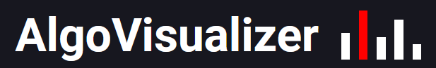
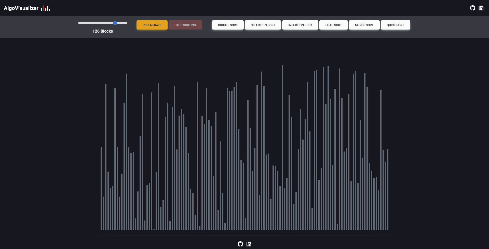
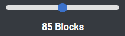
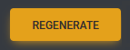
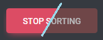
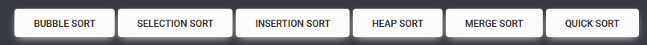
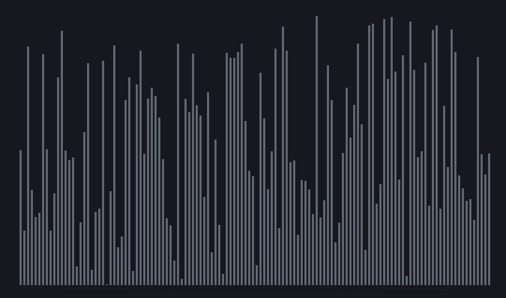

  

## General Information

AlgoVisualizer is a web application that allows users to see a visual representation of popular data sortings algorithims in action in order to gain/demonstrate an understanding of how they operate. Users can change the size of the dataset, generate a new one, and pick from a series of sorting algorithims to sort with.

## Table of Contents

- [General Information](#general-information)
- [Deployed Site](#deployed-site)
- [Preview](#demo)
- [Description](#description)
- [Dependencies](#dependencies)
- [Usage](#usage)
- [Credits](#credits)
- [Contact](#contact)
- [License](#license)

## Deployed Site

The deployed site can be found [here](https://kevrev.github.io/AlgoVisualizer/).

## Preview

---

## Description

Users are given the ability to generate new random arrays along with the ability to change the size of the array they wish to sort. Each value in the array corresponds to the height of a 'block' shown in the visual representation. The currently included sorting algorithims are Bubble Sort, Insertion Sort, Selection Sort, Heap Sort, Quick Sort, and Merge Sort. The sorting operation is executed when one of the sort buttons is pressed.

When a sorting operation is in progress, the 'Stop Sorting' button will appear and all other buttons will be disabled until either the operation completes or the 'Stop Sorting' button is pressed. The array is maintained in its current orientation after sorting and can continue to be sorted once a sorting operation is selected again.

---

## Dependencies

- [react v18.3.1](https://reactjs.org/) - JavaScript library for building reactive websites and user interfaces.
- [node.js v20.12.0](https://nodejs.org/en) - A scalable server-side JavaScript runtime. Used for installing dependencies and running the application locally.
- [fontawesome v6.5.2](https://fontawesome.com/) - A large icon library/toolkit. 
- [mdb-react-ui-kit v8.0.0](https://mdbootstrap.com/docs/react/) - A UI Kit containing many different components, such as buttons and sliders, and allows them to be imported as React components.

---

## Installation

### Prerequisites

- [Node.js](https://nodejs.org/en/) - Node is necessarry to install the required dependencies as well as run/build the application locally. 

### Clone

Clone the [repository](https://github.com/Kevrev/AlgoVisualizer) to your local machine.

### Setup

1. Navigate to the root directory of the cloned repository in your terminal.
2. Run `npm install` to install all of the required dependencies.
3. Start the full stack application by running `npm start` from the root directory.
4. Navigate to `http://localhost:3000` in your browser to view the site.

---

## Usage

### Slider

The slider is used to adjust the size of the Block Array, ranging from a minimum of 10 blocks to a maximum of 160 blocks.

### Regenerate

Generates a new Block Array with the current selected value of the slider. Disabled when a sorting opertaion is in progress.

### Stop Sorting

This becomes active when a sorting operation is in progress and can be used to stop the current sort. The array maintains its current position and sorting can be resumed by clicking on another sort. Disabled when no sorting operation is currently ongoing.

### Sorting Algorithims

Each button represent a sorting algoritihm function corresponding to their respective names. Pressing one button will execute that sorting operation and the block array will animate its change accordingly. The speed of each sorting function is not an accurate representation of each sorting algorithim's true speed as they have been slowed for the purpose of visual clarity. Disabled when a sorting opertaion is in progress.

### Block Array

This is the randomly generated array with each of its values corresponding to the pixel height of a respective block. The values can range from a minimum of 1 to a maximum of 650, with duplicate values also being possible. The values of the block array will shift around when a sorting operation is ongoing. 

---

## Credits

### Resources

The following resources and individuals made invaluable contributions to the project:

#### Fonts

- [Roboto](https://fonts.google.com/specimen/Roboto) by Christian Robertson. Used as the default font for most of the text found on the page.

#### Images

- [Shields.io](https://shields.io/) provides the badges for the README.

#### Templates / Libraries

- [Material Design for Bootstrap 5 & React 18](https://mdbootstrap.com/docs/react/) was used for the interactive components such as the sliders and buttons as well as the icons for external site links like GitHub and LinkedIn.

## Contact

- Kevin Small - [kevrev](https://github.com/Kevrev) / [LinkedIn](https://www.linkedin.com/in/kevin-small-a77152285/)

---

## License

This project is open source and available under the [MIT License](./LICENSE).

---